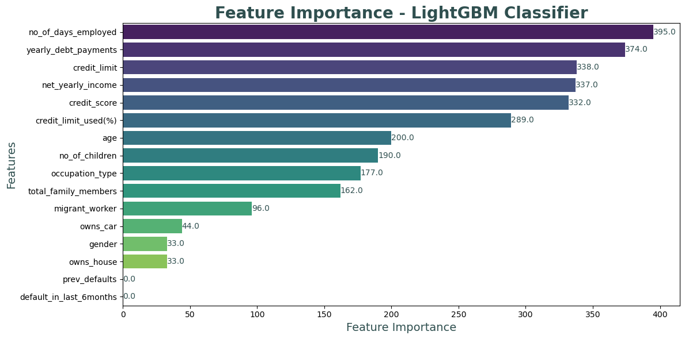

# CreditRisk: Predicting Borrower Reliability
---
## Introduction

## About DataSet and EDA

### Figure 01. Distribution of `1 Will Default` & `0 Will not Default`

#### Figure 02. Histogram of Categorical Data

#### Figure 03. Histogram of Numerical Data

#### Figure 04. Scatter matrix of Numerical Data

## 01. Extra Tree Classifier
## 02. MLP Classifier (Neural Networks)
## 03. Gradient Boosting Classifier
## 04. Logistic Regression
## 05. Adaptive Boosting Classifier
## 06. Support Vector Machine
## 07. K-Neighbours Classifier
## 08. Random Forest Classifier
## 09. Decision Tree Classifier
## 10. CatBoost Classifier
## 11. LightGBM Classifier
## 12. XGBoost Classifier
## 13. Majority Classifier

### Figure 05. Significance of features for (a) Random Forest Model, (b) XGBoost Model

## Classification and Evaluation 

### Figure 06. Confusion Matrix (a) Random Forest Model, (b) XGBoost Model

### Figure 07. Comaprison of (a) Accuracy, (b) precision, (c) Recall, (d) F1 score for both model

### Figure 08. Comaprison of (a) Receiver Operating Characteristic (ROC), (b) Area Under curve (AUC)

## Conclusion
This project underscores the potential of machine learning in healthcare, particularly in predicting heart failure risk. By leveraging models like Random Forest and XGBoost, we canoffer a reliable approach for early risk identification in future, paving the way for personalized medicine and better management of cardiovascular diseases. Despite the limitations, the outcomes of this study provide a strong foundation for further research and application, contributing to the broader goal of reducing CVD-related morbidity and mortality.

# ----------------------------------------------------------------
### * If want to know more about this project there are python Notebook file, Project report paper and all other resources included in same repository.
### * Feel free to reach out, I'm open to engaging in meaningful conversations and exchanging ideas on these areas. I welcome the chance to explore new insights, collaborate on projects, and contribute to ongoing discussions in these fields.

## Model Performance Metrics
`1 Will Default` & `0 Will not Default`

|                Model                   | Accuracy | Precision(1) | Recall(1) | Precision(0) | Recall(0) |
|----------------------------------------|----------|--------------|-----------|--------------|-----------|
| `Extra Tree Classifier`                | 0.978970 |    1.00      |   0.75    |     0.98     |   1.00    |
| `MLP Classifier (Neural Networks)`     | 0.973569 |    0.86      |   0.82    |     0.98     |   0.99    |
| `Gradient Boosting Classifier`         | 0.975983 |    0.92      |   0.79    |     0.98     |   0.99    |
| `Logistic Regression`                  | 0.978970 |    0.97      |   0.78    |     0.98     |   1.00    |
| `Adaptive Boosting Classifier`         | 0.978970 |    1.00      |   0.75    |     0.98     |   1.00    |
| `Support Vector Machine`               | 0.978970 |    1.00      |   0.75    |     0.98     |   1.00    |
| `K-Neighbours Classifier`              | 0.974259 |    0.96      |   0.73    |     0.98     |   1.00    |
| `Random Forest Classifier`             | 0.978970 |    1.00      |   0.75    |     0.98     |   1.00    |
| `Decision Tree Classifier `            | 0.978626 |    0.99      |   0.75    |     0.98     |   1.00    |
| `CatBoost Classifier`                  | 0.977936 |    0.94      |   0.79    |     0.98     |   1.00    |
| `LightGBM Classifier`                  | 0.977706 |    0.94      |   0.79    |     0.98     |   1.00    |
| `XGBoost Classifier`                   | 0.978970 |    1.00      |   0.75    |     0.98     |   1.00    |
|  -------                                      |          |              |           |              |           |
| `Majority Classifier`                  | 0.978970 |    1.00      |   0.75    |     0.98     |   1.00    |

