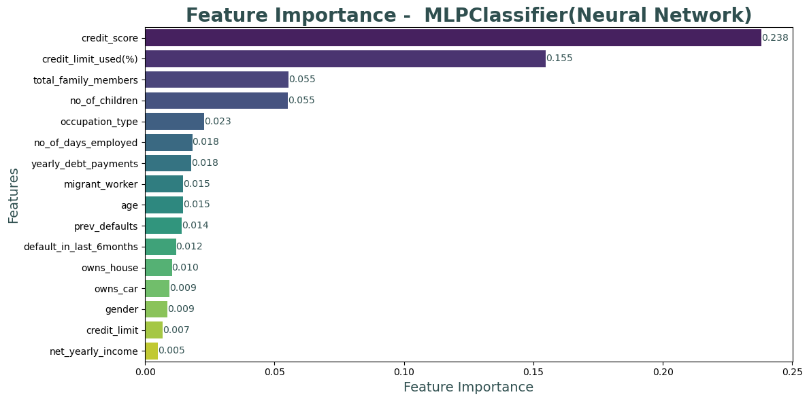
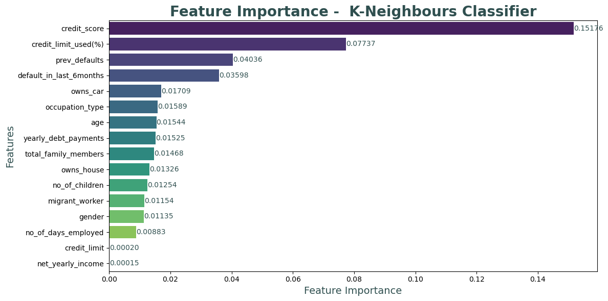
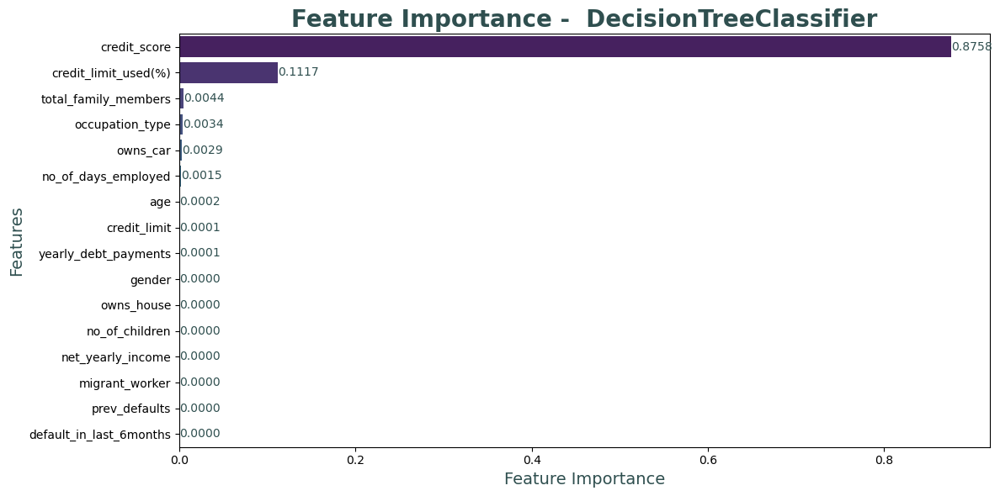
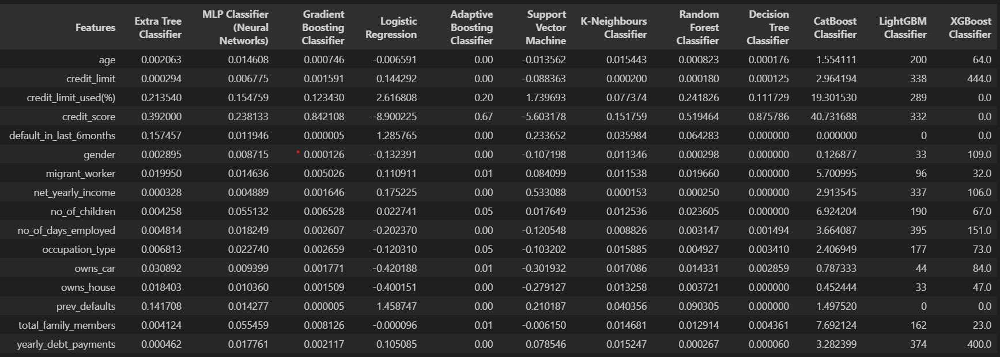
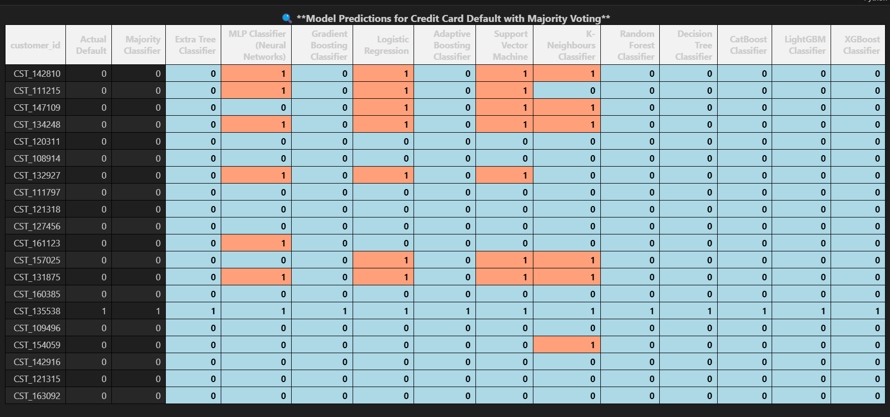

🚀 **Explore the repository for code, analysis, and results!**
---
# CreditRisk: Predicting Borrower Reliability
---

## 🔍 Introduction  

Credit card default is a critical issue in the financial sector, where banks and financial institutions need to assess the risk associated with lending. This project aims to develop a **machine learning model** that predicts whether a customer will default on their credit card payment.  

Using the **AmExpert CodeLab 2021 dataset**, I analyzed various demographic, financial, and credit-related features to identify patterns in customer behavior. The goal is to **enhance risk assessment strategies**, helping financial institutions make informed lending decisions and reduce financial losses.  

In this project, I used different machine learning techniques, including **ensemble models, deep learning, and feature engineering**, to improve predictive accuracy.  

## 📌 About the Dataset  
📂 **Dataset Link**: [Kaggle - AmExpert CodeLab 2021](https://www.kaggle.com/datasets/pradip11/amexpert-codelab-2021)  

The dataset consists of various features related to customer demographics, financial status, and credit behavior: `customer_id`, `age`,`gender`, `owns_car`, `owns_house`, `num_children`, `net_yearly_income`, `num_days_employed`, `occupation_type`, `total_family_members`, `migrant_worker`, `yearly_debt_payments`, `credit_limit`, `credit_limit_used (%)`, `credit_score`, `previous_defaults`, `default_in_last_6_months`, `credit_card_default 🔴 Target Variable`

### Distribution of `1 Will Default` & `0 Will not Default`

## 🌲 Extra Tree Classifier
The **Extra Trees Classifier (Extremely Randomized Trees)** is an ensemble learning method that builds multiple decision trees and aggregates their results to improve accuracy and reduce overfitting. Unlike Random Forest, it selects split points **completely at random**, making it more computationally efficient while maintaining strong predictive performance.  
### Feature Importance of `Extra Tree Classifier`

## 🔗 MLP Classifier (Neural Networks)  
The **MLP Classifier (Multi-Layer Perceptron)** is a type of **artificial neural network** that learns complex patterns from data through multiple layers of interconnected neurons. It uses **backpropagation** and **gradient descent** to adjust weights and minimize errors.  
### Feature Importance of `MLP Classifier (Neural Networks)`

## 🚀 Gradient Boosting Classifier  
The **Gradient Boosting Classifier** is an **ensemble learning algorithm** that builds a series of weak learners (typically decision trees) and combines them to create a **strong predictive model**. It minimizes errors by **sequentially correcting previous mistakes** using gradient descent.  
### Feature Importance of `Gradient Boosting Classifier`

## 🔹 Logistic Regression  
**Logistic Regression** is a **supervised learning algorithm** used for **binary classification** problems. It predicts the probability that a given input belongs to a particular class using the **logistic (sigmoid) function**.  
### Feature Importance of `Logistic Regression`

## 🚀 Adaptive Boosting (AdaBoost) Classifier  
The **Adaptive Boosting (AdaBoost) Classifier** is an **ensemble learning method** that combines multiple weak learners (typically decision trees) to create a **strong classifier**. It works by **iteratively adjusting the weights** of misclassified instances, making the next model focus more on difficult cases.  
### Feature Importance of `Adaptive Boosting Classifier`

## 🚀 Support Vector Machine (SVM)  
The **Support Vector Machine (SVM)** is a **powerful supervised learning algorithm** used for both **classification and regression tasks**. It works by finding the **optimal hyperplane** that best separates different classes in the feature space.  
### Feature Importance of `Support Vector Machine`

## 🚀 K-Nearest Neighbors (K-NN) Classifier  
The **K-Nearest Neighbors (K-NN)** classifier is a simple, yet powerful **instance-based learning algorithm** used for **classification and regression** tasks. It works by classifying a data point based on the majority class of its **K nearest neighbors** in the feature space.  
### Feature Importance of `K-Neighbours Classifier`

## 🌲 Random Forest Classifier 
The **Random Forest Classifier** is an ensemble learning algorithm that combines the predictions of multiple decision trees to improve classification accuracy. It builds multiple decision trees during training and merges them together to obtain a more accurate and stable prediction.
### Feature Importance of `Random Forest Classifier`

## 🌱 Decision Tree Classifier
The **Decision Tree Classifier** is a popular supervised machine learning algorithm used for classification tasks. It builds a tree-like model by recursively splitting the dataset based on feature values. Each internal node of the tree represents a decision based on a feature, and each leaf node corresponds to a class label. The model selects the feature that best separates the data at each step using criteria such as **Gini Impurity** or **Information Gain**.
### Feature Importance of `Decision Tree Classifier`

## 🐱 CatBoost Classifier
The **CatBoost Classifier** is an advanced gradient boosting algorithm developed by Yandex, designed for handling categorical data efficiently. It is based on **Gradient Boosting** techniques and is known for its speed, accuracy, and ability to handle categorical features without the need for manual encoding. The model builds an ensemble of decision trees, optimizing them to minimize loss and improve prediction accuracy iteratively.
### Feature Importance of `CatBoost Classifierr`

## 🔥 LightGBM Classifier

**LightGBM (Light Gradient Boosting Machine)** is a highly efficient, scalable gradient boosting framework that is designed for fast training with large datasets. It uses a histogram-based approach and supports **parallelization** and **GPU acceleration**. LightGBM is capable of handling both **categorical features** and large-scale data with minimal memory usage. It is widely used for classification and regression tasks due to its high performance and accuracy, especially in competitive machine learning environments.
### Feature Importance of `LightGBM Classifier`

## 🌟 XGBoost Classifier
**XGBoost (Extreme Gradient Boosting)** is an optimized gradient boosting algorithm designed for speed and performance. It is widely known for its **accuracy** and **scalability**, particularly in classification and regression tasks. XGBoost employs advanced regularization techniques, such as **L1** and **L2** regularization, to prevent overfitting and improve model generalization. It supports **parallel processing**, **GPU acceleration**, and is capable of handling large datasets efficiently. XGBoost is often the go-to algorithm for data science competitions due to its outstanding performance and ability to handle diverse types of data.
### Feature Importance of `XGBoost Classifier`

## Majority Plot

### Table for Weight of features for each model

### Plot for Significance of features for each model

## Classification and Evaluation

## Model Performance Metrics
`1 Will Default` & `0 Will not Default`

|                Model                   | Accuracy | Precision(1) | Recall(1) | Precision(0) | Recall(0) |
|----------------------------------------|----------|--------------|-----------|--------------|-----------|
| `Extra Tree Classifier`                | 0.970811 | 0.799014     | 0.876861  | 0.988468     | 0.979530  |
| `MLP Classifier (Neural Networks)`     | 0.971156 | 0.812020     | 0.859269  | 0.986869     | 0.981540  |
| `Gradient Boosting Classifier`         | 0.974374 | 0.870690     | 0.820027  | 0.983387     | 0.988698  |
| `Logistic Regression`                  | 0.963457 | 0.722281     | 0.925575  | 0.992908     | 0.966972  |
| `Adaptive Boosting Classifier`         | 0.957711 | 0.673203     | 0.975643  | 0.997641     | 0.956047  |
| `Support Vector Machine`               | 0.961273 | 0.706790     | 0.929635  | 0.993273     | 0.964209  |
| `K-Neighbours Classifier`              | 0.951505 | 0.663571     | 0.870095  | 0.987586     | 0.959061  |
| `Random Forest Classifier`             | 0.968283 | 0.759239     | 0.917456  | 0.992189     | 0.973000  |
| `Decision Tree Classifier`             | 0.966100 | 0.736674     | 0.935047  | 0.993818     | 0.968982  |
| `CatBoost Classifier`                  | 0.974489 | 0.858530     | 0.837618  | 0.984964     | 0.987191  |
| `LightGBM Classifier`                  | 0.974718 | 0.862937     | 0.834912  | 0.984725     | 0.987693  |
| `XGBoost Classifier`                   | 0.959090 | 0.683958     | 0.963464  | 0.996476     | 0.958684  |
| -------------------------------------- |          |              |           |              |           |
| `Majority Classifier`                  | 0.970696 | 0.790168     | 0.891746  | 0.989832     | 0.978023  |

### Plot of accuracy for each model

### Plot of accuracy for each model

### Evaluation metices of majority plot

## Result and Conclusion

### sample result for each model

# ----------------------------------------------------------------
### * If want to know more about this project there are python Notebook file, Project report paper and all other resources included in same repository.
### * Feel free to reach out, I'm open to engaging in meaningful conversations and exchanging ideas on these areas. I welcome the chance to explore new insights, collaborate on projects, and contribute to ongoing discussions in these fields.

